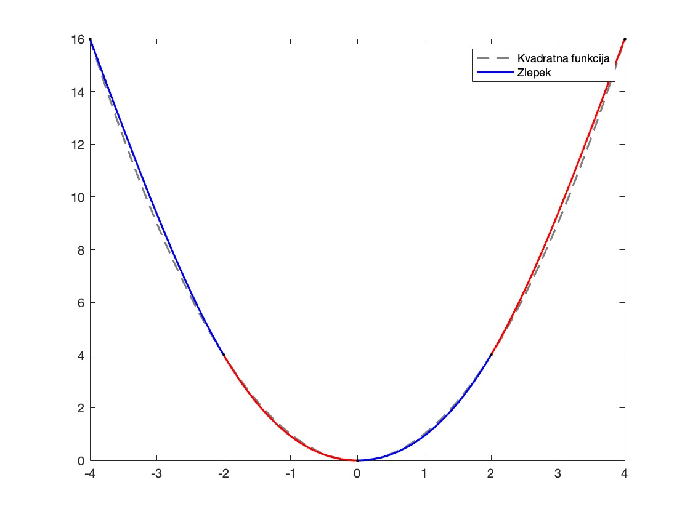

# Naravni zlepek: interpolacija s kubičnim zlepkom 
**Petra Kuralt**

## Opis naloge
Cilj naše naloge je zgraditi funkcijo - zlepek, ki se čimbolj gladko prilagaja podanim točkam. Zlepek je sestalvljen iz več polinomov tretje stopnje ter določen s posebnimi pogoji, da je prehod med točkami čimbolj gladek. <br>
V ta namen smo ustvarili funkcijo `interpoliraj(x,y)`, ki sprejme vektor x in y točk, izračuna pa koeficiente polinomov. Znotraj funkcije s Thomasovim algoritmom rešujemo tridiagonalni sistem enačb ter pridobljene koeficiente polinomov uporabimo, da ustvarimo objekt Zlepek. V razredu Zlepek imamo definirano tudi funkcijo za vračanje vrednosti zlepka na dani točki x ter funkcijo za izrisovanje grafa zlepka.

### Primer uporabe
Imamo pet točk, ki sledijo kvadratni funkciji y = x<sup>2</sup>:<br>
(-4,16) (-2,4) (0,0) (2,4) (4,16) <br>
Na podlagi teh točk zgradimo zlepek iz štirih polinomov tretje stopnje. Če izrišemo kvadratno funkcijo z črtkano črto ter zlepek z rdeče-modro črto, lahko analiziramo gladkost prehodov med posameznimi polinomi v primerjavi z dejansko kvadratno funkcijo.
 


## Datotečni sistem
```
projekt
│    README.md
│
└─── src
│   └─── notebook.mlx
│       │   1. matematično ozadje
│       │   2. primer interpolacije (kliče funckijo interpoliraj)
│       │   3. primer interpolacije (kliče funckijo interpoliraj)
│   │
│   └─── interpoliraj.m
│       │   1. izračuna koeficiente zlepka
│       │   2. kliče razred Zlepek
│   └─── Zlepek.m
│       │   1. naredi objekt Zlepek 
│       │   2. vsebuje funckijo za vračanje vrednosti
│       │   3. vsebuje funckijo za izris grafa
│   
└─── test
    └─── run_test_coverages.m
    └─── test.m
```
   
## Kako pognati kodo
   - Pojdite v mapo `src` in odprite datoteko `notebook.mlx` v MATLAB-u.
   - V dokumentu je najprej razloženo matematično ozadje, spodaj pa sta na voljo dva primera uporabe funkcije vsak v svoji celici.
   - Zaženite posamezni primer s klikom na "Run Section" ali celoten dokument s klikom na "Run".
   - Pri strani se vam bodo izrisali grafi ter izpisi funkcije.

## Kako ustvariti poročilo
   - Pojdite v mapo `src` in odprite datoteko `notebook.mlx` v MATLAB-u.
   - Levo zgoraj kliknite "Export" ter "Export to pdf".

## Kako pognati teste
   - Pojdite v mapo `test` in odprite datoteko `run_test_coverages.m` v MATLAB-u.
   - Zaženite teste s klikom na "Run".
   - Testirata se glavna funkcija interpoliraj.m ter razred Zlepek.m 
   - Na desno se vam v command window-u najprej izpišejo rezultati obeh testov ter nato napis: <em>"MATLAB code coverage report has been saved to: pot/do/coverage/reporta"</em>.
   - Če kliknete na izpisano povezavo si lahko ogledate tudi poročilo pokritosti.

