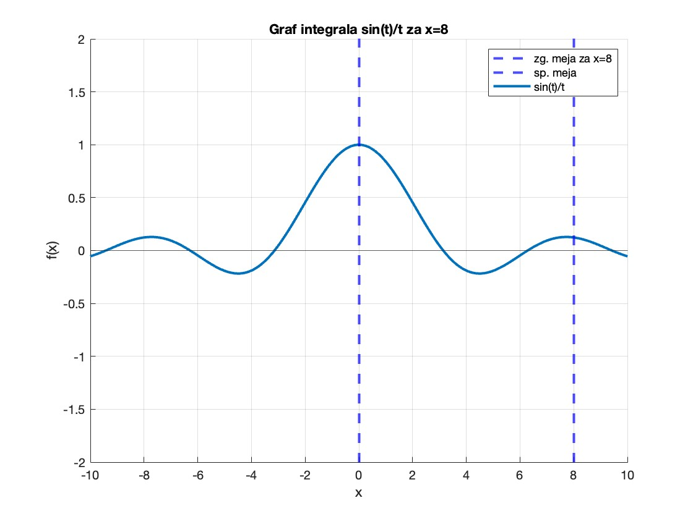
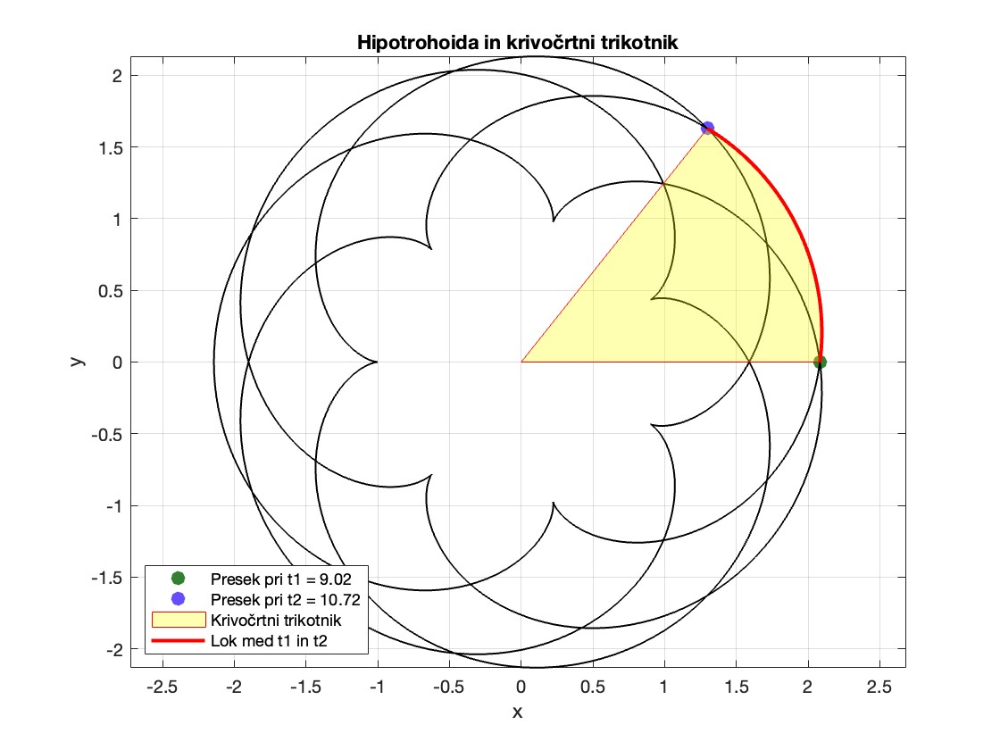

# Integralski sinus in ploscina hipotrohoide
**Petra Kuralt**

### 1. Integralski sinus
Cilj prvega dela naloge je napisati učinkovito funckijo, ki izračuna analitično nerešiljivo funkcijo integralskega sinusa
$ Si(x) = \int_{0}^{x} \frac{sin(t)}{t} \, dt$. <br>
Aproksimacijo izvedemo s pomočjo pomožnih funkcij, zapisani v priročniku Abramowitz in Stegun, kjer funkcije pretvorimo v oblike, kjer ne aproksimiramo mej v neskončnost in nato za izračun teh uporabimo simpsonovo metodo.

#### Primer uporabe
Če želimo izračunati integralski sinus od 0 do na primer 8, kličemo funkcijo `aproksimiraj_Si(x,n)`, kjer za $x$ vstavimo 8 kot zgornjo mejo integrala, za $n$ pa ustavimo število podinteravlov pri simpsonovi metodi, na primer 100.
```matlab
rezultat = aproksimiraj_Si(8,100);
```
 

### 2. Ploščina hipotrohoide
Cilj drugega dela naloge je izračunati površino, ki jo omejuje hipotrohoida, podana s parametroma $a = 1$ in $b = -\frac{11}{7}$. Ploščino računamo s pomočjo formule za krivočrtni trikotnik, kjer hipotrohoido razdelimo na 7 krivočrtnih trikotnikov in integral računamo s simpsonovo metodo. Da dobimo meje integrala, računamo presečišče hipotrohoide z $x$ osjo in premico $y = tan(\frac{2\pi}{7}) x$.

#### Primer uporabe
Za računanje ploščine hipotrohoide kličemo funkcijo `pl_hipotrohoide()`. Dobimo njeno ploščino, ploščino krivočrtnega trikotnika ter zgornjo in spodnjo mejo pri računaju integrala ploščine krivočrtnega trikotnika. Zgornja in spondja meja sta parametra $t$, ki določata začetek in konec loka pri trikotniku ali presečišče hipotrohoide z $x$ osjo in premico $y = tan(\frac{2\pi}{7})x$.
```matlab
[pl_hipotrhoide, pl_trikotnika, zg_meja, sp_meja] = pl_hipotrohoide();
```
 


## Datotečni sistem
```
project
│    README.md
│
└─── src
│   └─── notebook.mlx
│       │   1. matematično ozadje integralskega sinusa
│       │   2. izračun aproksimacij za različne meje
│       │   3. matematično ozadje računanja ploščine hipotrohoide
│       │   3. izračun ploščine
│   │
│   └─── aproksimiraj_Si.m
│       │   1. aproksimira Ci(x) in si(x) s simpsonovo metodo
│       │   2. izračuna pomožne funkcije
│
│   └─── simp_metoda.m
│       │   1. aproksimira integral
│
│   └─── pl_hipotrohoide.m
│       │   1. računa meje integrala/preseke z newtonovo iteracijo
│       │   2. integral aproksimira s simpsonovo metodo
│       │   3. izračuna ploščino hipotrohoide 
│
│   └─── newt_iteracija.m
│       │   1. išče ničle nelineranega sistema dveh enačb
│   
└─── test
    └─── run_test_coverages.m
    └─── test.m
```
   
## Kako pognati kodo
   - Pojdite v mapo `src` in odprite datoteko `notebook.mlx` v MATLAB-u.
   - V dokumentu je najprej razloženo matematično ozadje obeh delov nalog nato pa se kličeta funkciji za aproksimacijo integralskega sinsua in ploščino hipotrohoide
   - Zaženite posamezni primer s klikom na "Run Section" ali celoten dokument s klikom na "Run".
   - Pri strani se vam bodo izrisali grafi ter izpisi funkcij.

## Kako ustvariti poročilo
   - Pojdite v mapo `src` in odprite datoteko `notebook.mlx` v MATLAB-u.
   - Levo zgoraj kliknite "Export" ter "Export to pdf".

## Kako pognati teste
   - Pojdite v mapo `test` in odprite datoteko `run_test_coverages.m` v MATLAB-u.
   - Zaženite teste s klikom na "Run".
   - Testirata se oba dela naloge: aproksimacija integralskega sinusa, simpsonova metoda, račun ploščine hipotrohoide in newtonova metoda. 
   - Na desno se vam v command window-u najprej izpišejo rezultati testov ter nato napis: <em>"MATLAB code coverage report has been saved to: pot/do/coverage/reporta"</em>.
   - Če kliknete na posamezne izpisane povezave si lahko ogledate tudi poročila pokritosti.

