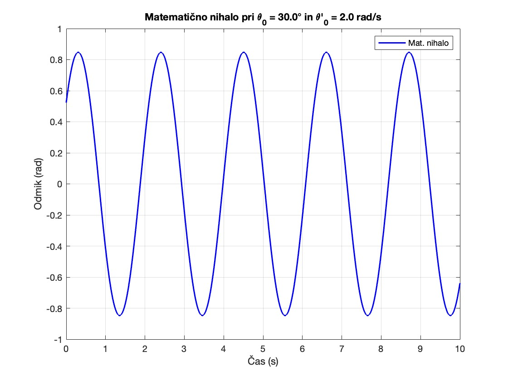

# Integralski sinus in ploscina hipotrohoide
**Petra Kuralt**

### Matematično nihalo
V tej nalogi smo se osredotočili na analizo gibanja matematičnega nihala, ki ga opisuje diferencialna enačba drugega reda:<br>
$\frac{g}{l} sin(\theta(t)) + \theta^{\prime \prime}(t) = 0$,<br>
kjer je $g$ gravitacijski pospešek, $l$ pa dolžina nihala. Diferencialno enačbo smo pretvorili v sistem dveh enačb prvega reda in jih rešili numerično z metodo Runge-Kutta reda 4. Napisali smo funkcijo `nihalo`, ki iz podanega začetnega odmika in začetne kotne hitrosti izračuna gibanje nihala skozi čas. <br>
Rezulate smo primerjali s harmoničnim nihalom, ki analitično reši diferencialno enačbo za majhne začetne odmike $\theta_0$. Primerjali smo tudi nihajni čas glede na različne začetne hitrosti ter fazne diagrame gibanja matematičnega nihala.

#### Primer uporabe
Če želimo izračunati gibanje nihala s podanim začetnim odmikom $\theta_0$ in začetno hitrostjo $\theta^{\prime}_0$, lahko kličemo funkcijo `nihalo(fixed_vars, theta0, dtheta0)`, kjer so fixed_vars sestavljene iz vektorja: [gravitacija, dolzina nihala, št. podintervalov, čas opazovanja]. Kot rezultat dobimo odmike nihala ter njegovo kotno hitrost skozi čas.
```matlab
odmik = nihalo([g,l,n,t], theta0, dtheta0);
```
 


## Datotečni sistem
```
project
│    README.md
│
└─── src
│   └─── notebook_dn3.mlx
│       │   1. matematično ozadje
│       │   2. grafi harmonicnega in mat. nihala
│       │   3. grafi nihajnega časa
│       │   3. fazni diagrami
│   │
│   └─── nihalo.m
│       │   1. aproksimira gibanje nihala z RK metodo
│
│   └─── RK4.m
│       │   1. implementacija Runge-Kutta metode reda 4
│
│   └─── compare_pendulum_harmonic.m
│       │   1. Primerja gibanje har. in mat. nihala
│
│   └─── analyze_periods.m
│       │   1. Primerja nihajni čas glede na začetno energijo/hitrost
│
│   └─── plot_phase_diagrams.m
│       │   1. Primerja fazne diagrama glede na zač. hitrost in odmik
│   
│   
└─── test
    └─── run_test_coverages.m
    └─── test.m
```
   
## Kako pognati kodo
   - Pojdite v mapo `src` in odprite datoteko `notebook.mlx` v MATLAB-u.
   - V dokumentu je najprej razloženo matematično ozadje nato pa se kličejo tri funkcije za izrisovanje grafov za primerjavo nihal (primerjava gibanja, period in faznih diagramov)
   - Zaženite posamezno funkcijo s klikom na "Run Section" ali celoten dokument s klikom na "Run".
   - Pri strani se vam bodo izrisali grafi.

## Kako ustvariti poročilo
   - Pojdite v mapo `src` in odprite datoteko `notebook.mlx` v MATLAB-u.
   - Levo zgoraj kliknite "Export" ter "Export to pdf".

## Kako pognati teste
   - Pojdite v mapo `test` in odprite datoteko `run_test_coverages.m` v MATLAB-u.
   - Zaženite teste s klikom na "Run".
   - Testiraja se funkcija nihalo in RK4. 
   - Na desno se vam v command window-u najprej izpišejo rezultati testov ter nato napis: <em>"MATLAB code coverage report has been saved to: pot/do/coverage/reporta"</em>.
   - Če kliknete na posamezne izpisane povezave si lahko ogledate tudi poročila pokritosti.

